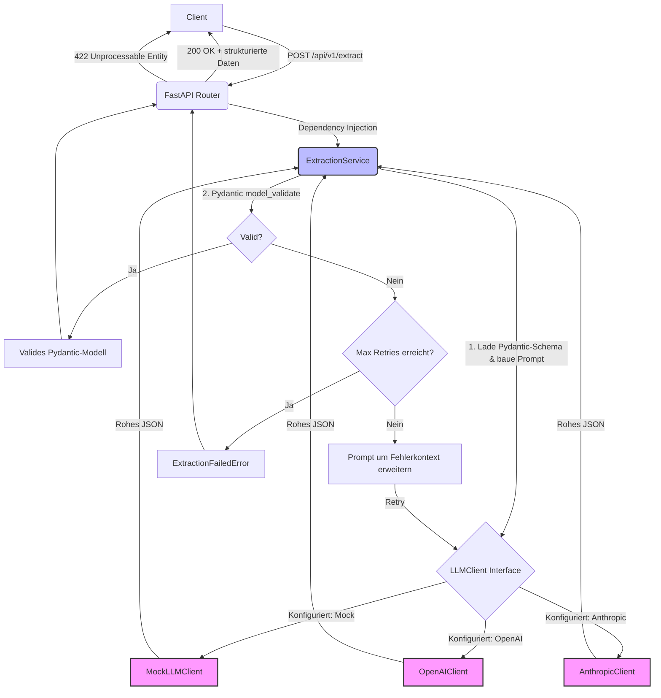

# 🧾 Pydantic AI Extraction Service

Ein produktionsnahes Beispielprojekt: **strukturierte, validierte Daten aus
unstrukturiertem Text extrahieren** – mit **Pydantic v2**, **FastAPI** und
austauschbaren **LLM-Providern** (OpenAI, Anthropic oder ein Mock-Client für
kostenlose lokale Nutzung).
---
## Einführung

Willkommen beim **Pydantic AI Extraction Service**, einem robusten Referenzprojekt für modernes AI-Engineering. Dieses Projekt demonstriert, wie unstrukturierte Texte (wie Rechnungen oder Lebensläufe) mithilfe von Large Language Models (LLMs) und strenger Typisierung in garantiert valide, strukturierte Daten verwandelt werden können. Durch die Kombination von FastAPI, Pydantic v2 und einem austauschbaren LLM-Client-Interface wird ein bewährtes "Self-Healing"-Muster implementiert, das Validierungsfehler automatisch abfängt und korrigiert. Das System läuft dank eines integrierten Mock-Providers sofort und ohne API-Keys, ist aber nahtlos für den Einsatz mit OpenAI oder Anthropic in der Produktion skalierbar. Es dient als ideale Grundlage, um Best Practices in API-Design, Datenvalidierung und zuverlässiger LLM-Integration zu demonstrieren.
---


    ---


> Portfolio-Projekt zum Thema *Structured Outputs / LLM-Engineering*.
> Läuft **sofort ohne API-Key** dank eines regelbasierten Mock-Providers.

[](https://github.com/DEIN-USERNAME/pydantic-ai-extraction/actions)


---

## Inhalt

- [Was macht das Projekt?](#was-macht-das-projekt)
- [Warum ist das relevant?](#warum-ist-das-relevant)
- [Architektur](#architektur)
- [Schnellstart](#schnellstart)
- [Nutzung](#nutzung)
- [Konfiguration / echte LLM-Provider aktivieren](#konfiguration--echte-llm-provider-aktivieren)
- [Tests](#tests)
- [Docker](#docker)
- [Projektstruktur](#projektstruktur)
- [Ausblick](#ausblick)

---

## Was macht das Projekt?

Die API nimmt unstrukturierten Text entgegen (z. B. eine Rechnung oder einen
Lebenslauf als Freitext) und gibt **garantiert valide, typisierte Daten**
gemäß eines Pydantic-Schemas zurück:

```bash
curl -X POST http://localhost:8000/api/v1/extract \
  -H "Content-Type: application/json" \
  -d '{
        "text": "Rechnungsnummer: INV-42. Gesamtbetrag: 119,00 EUR.",
        "document_type": "invoice"
      }'
```

```json
{
  "document_type": "invoice",
  "data": {
    "invoice_number": "INV-42",
    "issue_date": "2026-08-07",
    "vendor_name": "Mock Vendor GmbH",
    "customer_name": "Mock Customer AG",
    "line_items": [
      {"description": "Extrahierte Dienstleistung", "quantity": 1, "unit_price": 119.0, "total": 119.0}
    ],
    "currency": "EUR",
    "total_amount": 119.0
  }
}
```

## Warum ist das relevant?

LLMs geben von Natur aus **unstrukturierten Text** zurück. Für den produktiven
Einsatz (Automatisierung, Downstream-Systeme, Datenbanken) braucht man aber
**garantiert valide, typisierte Daten**. Dieses Projekt zeigt das dafür
zentrale Muster:

1. **Pydantic-Modell definiert die Zielstruktur** (inkl. Constraints wie
   `ge=0`, Cross-Field-Validierung wie "Fälligkeitsdatum nach Rechnungsdatum").
2. **LLM wird gezwungen, diesem Schema zu folgen** (Structured Outputs /
   Tool-Use), statt einfach "irgendein JSON" zu raten.
3. **Bei Validierungsfehlern** wird nicht einfach ein Fehler geworfen, sondern
   **einmal automatisch mit Fehlerkontext erneut versucht** ("Self-Healing").
4. **Der Provider ist austauschbar** – dieselbe Business-Logik funktioniert
   mit OpenAI, Anthropic oder (für Tests/Demo) einem Mock, ohne dass sich der
   Code des Services ändert.

## Architektur

```
Client
  │  POST /api/v1/extract  {text, document_type}
  ▼
FastAPI Router  ──▶  ExtractionService  ──▶  LLMClient (Interface)
                          │                     ├── OpenAIClient
                          │                     ├── AnthropicClient
                          │                     └── MockLLMClient (kein Key nötig)
                          ▼
                Pydantic-Modell-Validierung
                (Invoice / Resume)
                          │
              bei ValidationError: 1x Retry
              mit Fehlerkontext im Prompt
```

Details und Design-Entscheidungen: siehe [`docs/PLAN.md`](docs/PLAN.md).

## Schnellstart

Voraussetzung: Python 3.11+

```bash
git clone https://github.com/DEIN-USERNAME/pydantic-ai-extraction.git
cd pydantic-ai-extraction

python -m venv .venv
source .venv/bin/activate       # Windows: .venv\Scripts\activate

pip install -r requirements.txt

# .env ist optional — ohne sie läuft alles im MOCK-Modus, kein API-Key nötig
cp .env.example .env

uvicorn app.main:app --reload
```

Danach:
- API-Dokumentation (Swagger UI): http://localhost:8000/docs
- Health-Check: http://localhost:8000/api/v1/health

Alternativ mit `make`:

```bash
make install
make run
```

## Nutzung

### `POST /api/v1/extract`

| Feld | Typ | Beschreibung |
|---|---|---|
| `text` | `string` | Unstrukturierter Quelltext (1–20.000 Zeichen) |
| `document_type` | `"invoice" \| "resume"` | Zielschema für die Extraktion |

Antwort: `{ "document_type": ..., "data": {...} }` – `data` folgt exakt dem
jeweiligen Pydantic-Schema (siehe `app/models/invoice.py` bzw. `resume.py`).

Bei nicht extrahierbaren/ungültigen Daten antwortet die API mit `422` und
einer Fehlerbeschreibung; bei Provider-Fehlern (z. B. OpenAI down) mit `502`.

### `GET /api/v1/health`

Einfacher Health-Check für Monitoring/Orchestrierung.

## Konfiguration / echte LLM-Provider aktivieren

Standardmäßig läuft das Projekt mit `MockLLMClient` (regelbasiert, kein
Netzwerkzugriff, kein Key). Für echte LLM-Aufrufe in `.env` anpassen:

```dotenv
# OpenAI
LLM_PROVIDER=openai
OPENAI_API_KEY=sk-...
OPENAI_MODEL=gpt-4o-mini

# oder Anthropic
LLM_PROVIDER=anthropic
ANTHROPIC_API_KEY=sk-ant-...
ANTHROPIC_MODEL=claude-sonnet-5
```

und das jeweilige Paket installieren:

```bash
pip install openai        # für OpenAI
pip install anthropic     # für Anthropic
```

Die Business-Logik (`ExtractionService`) muss dafür **nicht** angepasst
werden – das ist der Sinn des `LLMClient`-Interfaces.

## Tests

```bash
pytest -v
# oder
make test
```

17 Tests decken ab:
- Pydantic-Modell-Validierung (positive & negative Fälle, Cross-Field-Checks)
- API-Integrationstests (End-to-End über `TestClient`, mit `MockLLMClient`)

Die CI-Pipeline (`.github/workflows/ci.yml`) führt Linting (`ruff`) und Tests
bei jedem Push/PR auf Python 3.11 und 3.12 aus.

## Docker

```bash
docker compose up --build
```

Die API ist danach unter `http://localhost:8000` erreichbar. Umgebungsvariablen
werden aus `.env` gelesen (siehe `docker-compose.yml`).

## Projektstruktur

```
pydantic-ai-extraction/
├── app/
│   ├── main.py                  # FastAPI-App, Entry Point
│   ├── config.py                # pydantic-settings Konfiguration
│   ├── models/                  # Pydantic-Datenmodelle (Invoice, Resume, ...)
│   ├── services/
│   │   ├── llm_client.py        # LLMClient-Interface + OpenAI/Anthropic/Mock
│   │   └── extraction_service.py# Orchestrierung inkl. Retry-Logik
│   ├── api/routes.py            # REST-Endpunkte
│   └── core/exceptions.py       # Custom Exceptions
├── tests/                       # Unit- & Integrationstests
├── examples/sample_invoice.txt  # Beispiel-Input
├── docs/PLAN.md                 # Ausführlicher Projektplan & Architektur-Doku
├── .github/workflows/ci.yml     # GitHub Actions CI
├── Dockerfile / docker-compose.yml
└── requirements.txt / pyproject.toml
```

## Ausblick

Mögliche nächste Schritte (bewusst nicht umgesetzt, um den Scope fokussiert
zu halten):

- PDF-/Bild-Upload statt nur Rohtext (z. B. via OCR-Vorverarbeitung)
- Persistenz der Extraktionsergebnisse (z. B. Postgres)
- Streaming-Responses für lange Dokumente
- Konfidenz-Scores pro extrahiertem Feld

---

**Kontext:** Dieses Projekt wurde als Teil meines Portfolios für Bewerbungen
als Junior AI Engineer erstellt, um den praktischen Umgang mit Pydantic,
FastAPI und LLM-Integrationsmustern zu demonstrieren. Feedback und Pull
Requests sind willkommen!
